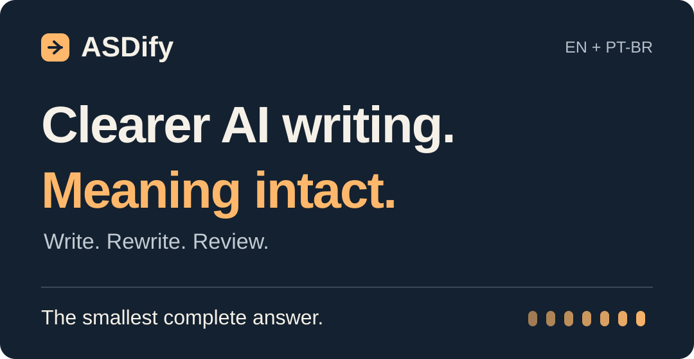
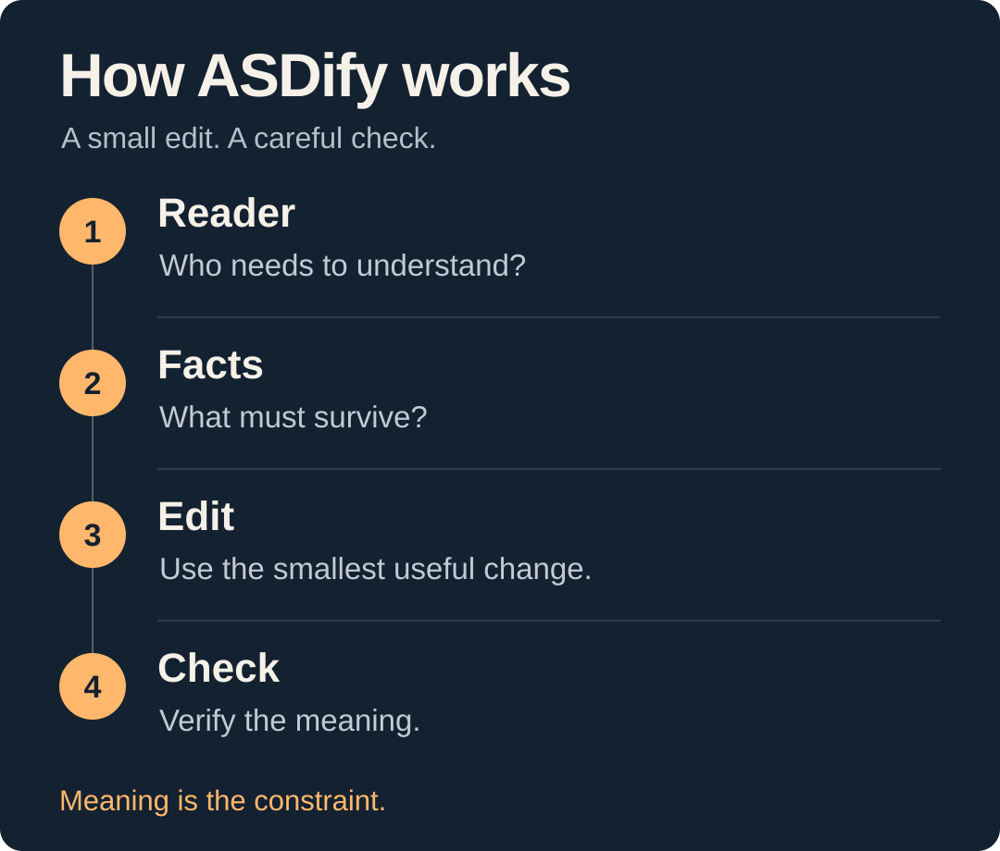

# ASDify



[](https://github.com/hevertonrodrigues/asdify/actions/workflows/validate.yml)
[](LICENSE)
[](skills/asdify/SKILL.md)
[](docs/LANGUAGES.md)

[English](README.md) · [Português (Brasil)](README.pt-BR.md) · [Español](README.es.md) · [Français](README.fr.md) · [Deutsch](README.de.md) · [日本語](README.ja.md) · [简体中文](README.zh-CN.md) · [Italiano](README.it.md) · [Русский](README.ru.md)

[Try it](#try-it-without-installing) · [Install](#install-for-your-agent) · [Languages](docs/LANGUAGES.md) · [Recipes](examples/recipes.md) · [Contribute](CONTRIBUTING.md)

Give your AI agent a repeatable editing routine: find the point, remove filler, and check that the important details survive. ASDify is a small, portable Markdown skill for answers, translations, status updates, reports, and documentation across supported coding agents and editors.

## See the difference


*Illustrative editorial example, not measured model output.* [Explore more before-and-after examples →](examples/before-after.md)

<details>
<summary><strong>Copy the illustrative edit</strong></summary>

```text
Unaudited, preliminary subscription revenue in Brazil grew 12% year over year,
excluding refunds.
```

</details>

## Try it without installing

1. Open [SKILL.md](skills/asdify/SKILL.md), copy its contents, and paste them as instructions into a chat, such as ChatGPT or Claude web.
2. Send this prompt:

```text
Use asdify full. Rewrite this update for an executive.
Return only the rewritten text. Preserve every fact and qualification.

We would like to highlight that preliminary subscription revenue grew 12%
year over year in Brazil, excluding refunds. These figures have not yet
been audited.
```

Compare the result with the details shown above. Wording can vary; the facts and qualifications must survive. This is a manual trial, with no automatic skill installation.

[See a real Codex run](docs/demos/codex-full-2026-10-08.md), with the exact prompt, output, and checks for preserved details.

## Install for your agent

ASDify itself needs no Node.js or npm. The optional Skills CLI below may prompt to download its npm package. Use the [local installer](INSTALL.md#local-installer) to avoid that download; [Cursor instructions without npm](INSTALL.md#cursor-without-nodejs-or-npm) cover the complete native skill.

Use the [Skills CLI](https://github.com/vercel-labs/skills) to discover ASDify and install it for your agent:

```bash
npx skills add hevertonrodrigues/asdify --list
npx skills add hevertonrodrigues/asdify --skill asdify --agent claude-code
```

Replace `claude-code` with your [supported agent ID](docs/HARNESSES.md), such as `codex`, `cursor`, `gemini-cli`, or `opencode`. Run from your target project; add `--global` for user-wide installation where supported. See the [full installation guide](INSTALL.md) for scopes, paths, and removal.

<details>
<summary><strong>Prefer the local installer?</strong></summary>

```bash
git clone https://github.com/hevertonrodrigues/asdify.git
cd asdify
bash scripts/install.sh --list
bash scripts/install.sh --agent claude-code --scope user
```

Choose an ID from `--list`. This installer copies the complete skill and its references from the clone, without downloading anything, and refuses to overwrite existing files unless you pass `--force`.

For native Cursor skills, its local ID is `cursor-skill`; `cursor` preserves the earlier compact project-rule adapter. The Skills CLI uses `cursor` for native skills. [See the distinction and paths](INSTALL.md#cursor-native-skill-or-compact-rule).

</details>

The [harness table](docs/HARNESSES.md) covers the supported registry snapshot. Installation layout checks and actual host sessions are tracked separately in [compatibility](docs/COMPATIBILITY.md). For a host outside the table, use its documented skill path or the manual chat trial above.

## How ASDify edits



Preserve numbers, dates, conditions, uncertainty, and necessary technical terms. Keep already-clear text. Do not invent advice, decisions, or deadlines during a rewrite.

| Mode | Choose it when… | What changes |
| --- | --- | --- |
| `lite` | You want a light edit | Wording; preserve the layout, order, and tone. |
| `full` · default | You want a clearer answer | Wording and structure, when useful. |
| `ultra` | Your draft has unnecessary framing or sections | More aggressive editing, with the same preservation rules. |

Request a mode with `Use asdify lite`, `full`, or `ultra`. Use `asdify off` to stop applying this optional workflow, subject to the host's other instructions. Modes are instructions; native command support varies by host.

## Languages and translation

English, Brazilian Portuguese, Spanish, French, German, Japanese, Simplified Chinese, Italian, and Russian have READMEs and regression inputs. Install the same canonical skill for every language; no language pack is needed. Rewrites keep the source language unless you request a translation.

```text
Use asdify full. Translate into Spanish (es).
Return only the translation. Preserve every fact and qualification.

Preliminary subscription revenue grew 12% year over year in Brazil,
excluding refunds. These figures are unaudited.
```

Name the target language or locale. ASDify preserves meaning, identifiers, placeholders, and requested formatting, while adapting grammar and register. See [multilingual examples](examples/multilingual.md) and [language coverage and support](docs/LANGUAGES.md). Translation quality depends on the host model; package tests do not verify it.

## Put it to work

| Task | What to protect | Copy a complete prompt |
| --- | --- | --- |
| Executive update | Status, ownership, tentative deadlines, conditions | [Try `full`](examples/recipes.md#1-executive-update-en) |
| Technical recommendation | Identifiers, actor, sequence, recommendation vs. requirement | [Try `lite` · PT-BR](examples/recipes.md#2-technical-recommendation-pt-br) |
| Dense decision brief | Estimates, exclusions, approval requirements | [Try `ultra`](examples/recipes.md#3-dense-decision-brief-en) |
| Already-clear message | The original wording, when no edit is useful | [Try the no-change case](examples/recipes.md#4-leave-clear-text-alone-en) |

## Built to be checked

A shorter answer that changes a material fact fails the evaluation. The repository includes rewrite and translation regression cases across nine languages, a human review rubric, and a [reproducible evaluation protocol](benchmarks/README.md). **Live-model quality gains have not yet been established.** See [package verification](docs/VERIFICATION.md) and [host compatibility](docs/COMPATIBILITY.md) for their separate checks.

Found a lost condition, changed number, or invented promise? [Report a meaning regression](https://github.com/hevertonrodrigues/asdify/issues/new?template=meaning_regression.yml). A small anonymized example makes a useful first contribution. See [CONTRIBUTING.md](CONTRIBUTING.md) for the steps.

[Roadmap](docs/ROADMAP.md) · [Changelog](CHANGELOG.md) · [MIT license](LICENSE)
