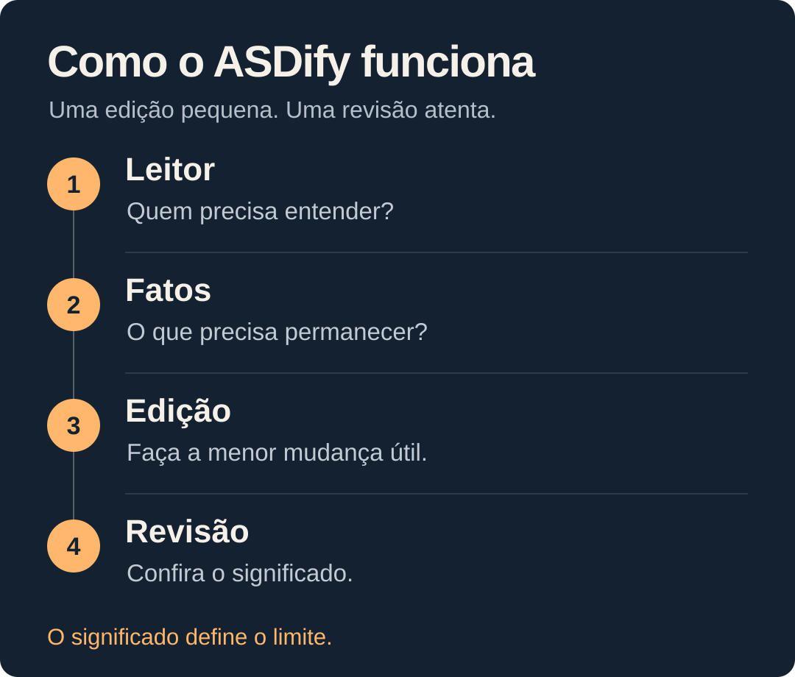

# ASDify


[](https://github.com/hevertonrodrigues/asdify/actions/workflows/validate.yml)
[](LICENSE)
[](skills/asdify/SKILL.md)
[](docs/LANGUAGES.md)

[English](README.md) · [Português (Brasil)](README.pt-BR.md) · [Español](README.es.md) · [Français](README.fr.md) · [Deutsch](README.de.md) · [日本語](README.ja.md) · [简体中文](README.zh-CN.md) · [Italiano](README.it.md) · [Русский](README.ru.md)

[Experimente](#experimente-sem-instalar) · [Instalação](#instale-no-seu-agente) · [Ambientes](#ambientes-compatíveis) · [Idiomas](docs/LANGUAGES.md) · [Suporte](SUPPORT.md) · [Receitas de uso](examples/recipes.md) · [Contribua](CONTRIBUTING.md)

Dê ao seu agente de IA uma rotina de revisão: identificar o ponto principal, remover excessos e conferir se os detalhes importantes foram preservados. ASDify é uma Skill pequena e portátil em Markdown para respostas, traduções, atualizações, relatórios e documentação nos agentes de programação e editores compatíveis.

## Veja a diferença


*Exemplo editorial ilustrativo, não um resultado medido em modelos.* [Veja mais exemplos de antes e depois →](examples/before-after.md)

<details>
<summary><strong>Copie a revisão ilustrativa</strong></summary>

```text
A receita preliminar de assinaturas no Brasil cresceu 12% ano a ano,
excluindo reembolsos. Os números ainda não foram auditados.
```

</details>

## Experimente sem instalar

1. Abra [SKILL.md](skills/asdify/SKILL.md), copie seu conteúdo e cole como instruções em uma conversa, por exemplo no ChatGPT ou Claude web.
2. Envie este prompt:

```text
Use asdify full. Reescreva esta atualização para a diretoria.
Retorne apenas o texto revisado. Preserve todos os fatos e ressalvas.

Gostaríamos de destacar que a receita preliminar de assinaturas cresceu 12%
ano a ano no Brasil, excluindo reembolsos. Esses números ainda não foram
auditados.
```

Compare o resultado com os detalhes mostrados acima. A redação pode variar; os fatos e as ressalvas precisam ser preservados. É um teste manual, sem instalação automática da Skill.

[Veja uma execução real no Codex](docs/demos/codex-full-2026-10-08.md), com o prompt, a resposta e a conferência dos detalhes preservados (em inglês).

## Instale no seu agente

O ASDify é Markdown. Node.js e npm são necessários apenas se você escolher a Skills CLI opcional. Escolha um método que seu agente aceite:

| Método | Quando usar | Requisitos |
| --- | --- | --- |
| Skills CLI | Localização, seleção de agentes e instalação gerenciada | Node.js/npm e rede para downloads |
| Instalador local | Cópia verificada sem npm | Clone ou ZIP extraído, Bash e utilitários POSIX |
| Cópia manual | Instalação sem script, inclusive no Windows | Pasta completa e caminho documentado pelo agente |
| Instruções do projeto / regra do Cursor | O agente lê instruções persistentes | Arquivo de instruções ou diretório de regras |
| Plugin do Claude Code | Você usa o gerenciador de plugins | Claude Code com suporte a plugins |
| [Conversa manual](#experimente-sem-instalar) | Teste sem instalação | Interface que aceite instruções |

### Skills CLI

Localize a Skill e instale a partir do **projeto de destino**:

```bash
npx skills add hevertonrodrigues/asdify --list
npx skills add hevertonrodrigues/asdify --skill asdify --agent claude-code
```

Troque `claude-code` por um [ID da Skills CLI](docs/HARNESSES.md), como `codex`, `cursor`, `gemini-cli`, `github-copilot` ou `opencode`. `--global` escolhe o escopo do usuário; `--copy` usa cópias em vez de links simbólicos. Para vários agentes, use `--agent claude-code cursor codex`. Veja [todas as opções](INSTALL.md#scope-copies-and-multiple-agents).

`Ok to proceed? (y)` pede autorização para baixar a CLI no cache do npm. Digite `y` ou use `--yes` antes de `skills`. Um segundo `--yes`, no final, aceita as confirmações da Skills CLI. Exemplo para uma cópia de usuário no Cursor, com telemetria da CLI desativada:

```bash
DISABLE_TELEMETRY=1 npx --yes skills add hevertonrodrigues/asdify --skill asdify --agent cursor --global --copy --yes
```

Os downloads ainda ocorrem quando necessários. A CLI também aceita uma origem local: `npx skills add /path/to/asdify --skill asdify --agent cursor`.

### Instalador local sem npm

```bash
git clone https://github.com/hevertonrodrigues/asdify.git
cd asdify
bash scripts/install.sh --list
bash scripts/install.sh --agent claude-code --scope user
```

Escolha um ID de `--list`. Você também pode usar **Code → Download ZIP** no GitHub, extrair e executar os comandos nessa pasta. Depois de obter os arquivos, o instalador não faz downloads nem coleta telemetria. Copia a Skill completa e suas referências; preserva instalações existentes sem `--force`. Revise antes de substituir e use `--help` para ver as opções.

Para a Skill nativa no Cursor, execute a partir do projeto de destino, substituindo o caminho da origem:

```bash
bash "/path/to/asdify/scripts/install.sh" --agent cursor-skill --scope project
```

Para seu usuário, execute `bash scripts/install.sh --agent cursor-skill --scope user` na pasta ASDify. O projeto recebe `.agents/skills/asdify/`; o usuário recebe `~/.cursor/skills/asdify/`. O ID local `cursor` instala a regra compacta; o ID `cursor` da Skills CLI instala a Skill nativa. [Compare formatos e caminhos](INSTALL.md#cursor-native-skill-or-compact-rule).

### Cópia manual ou instruções do projeto

Copie toda a pasta [skills/asdify/](skills/asdify/), incluindo `SKILL.md` e `references/`, para o [destino do agente](docs/HARNESSES.md). Crie as pastas necessárias e revise uma instalação existente antes de substituí-la. Com os arquivos disponíveis, não precisa de npm, Git nem Bash.

Para instruções persistentes, mescle [AGENTS.md](AGENTS.md) no arquivo do projeto, preservando as demais regras. Para a regra compacta do Cursor, use `bash "/path/to/asdify/scripts/install.sh" --agent cursor-rule --scope project` no projeto de destino, ou copie [cursor-rule.mdc](integrations/cursor-rule.mdc) para `.cursor/rules/asdify.mdc`. Os adaptadores compactos têm menos detalhes que a Skill completa.

### Plugin do Claude Code

O repositório inclui os manifestos do plugin e do marketplace. Em uma sessão do Claude Code:

```text
/plugin marketplace add hevertonrodrigues/asdify
/plugin install asdify@asdify
```

Escolha o escopo no gerenciador. É possível usar um [clone local](INSTALL.md#claude-code-plugin). Os manifestos passam na validação; uma instalação e ativação reais do plugin ainda não foram verificadas.

## Ambientes compatíveis

A [tabela completa](docs/HARNESSES.md) lista **82 IDs: 79 mapeamentos de agentes e 3 IDs de compatibilidade**, com escopos, caminhos e fontes. Inclui Claude Code, Cursor, Codex, Gemini CLI, GitHub Copilot, OpenCode, Windsurf, Cline, Continue e outros.

No Windows, use a Skills CLI ou a cópia manual. O script local requer Bash/POSIX; com WSL, instale no ambiente em que o agente lê Skills. A matriz automatizada cobre Linux/macOS; a execução no Windows não foi verificada. Para agentes remotos ou na nuvem, use Skills de projeto no checkout ou o mecanismo documentado pelo agente.

Para outro agente, use seu caminho documentado ou a conversa manual. `universal` é uma convenção de pasta, não uma garantia de descoberta em qualquer aplicação. [Compatibilidade](docs/COMPATIBILITY.md) separa cópia, ativação e qualidade. Após instalar, abra uma sessão nova e peça `Use asdify full`; no Cursor, confira **Customize → Skills**.

## Atualização e remoção

| Método | Atualizar | Remover |
| --- | --- | --- |
| Skills CLI | `npx skills update asdify` | `npx skills remove asdify --agent <id>`; acrescente `--global` para instalação de usuário |
| Instalador local | Obtenha a versão atualizada, revise e repita no mesmo agente/escopo com `--force` | Remova apenas a pasta ou regra ASDify indicada pelo instalador |
| Cópia manual / instruções | Revise e substitua a pasta ou o texto ASDify | Remova apenas essa pasta ou essas instruções |
| Plugin do Claude Code | Use a atualização do gerenciador | Desative ou desinstale `asdify@asdify` |

Na Skills CLI, use `--global` também para atualizar instalações de usuário. Pastas compartilhadas afetam todos os agentes que as leem. Preserve suas alterações antes de substituir. Veja [comandos e caminhos](INSTALL.md#removal-and-updates).

## Como o ASDify revisa



Preserve números, datas, condições, incertezas e termos técnicos necessários. Mantenha o que já está claro. Não invente recomendações, decisões ou prazos durante uma revisão.

| Modo | Quando usar | O que muda |
| --- | --- | --- |
| `lite` | Você quer uma revisão leve | A redação; preserva estrutura, ordem e tom. |
| `full` · padrão | Você quer uma resposta mais clara | A redação e a estrutura, quando isso ajuda. |
| `ultra` | O texto tem introduções ou seções desnecessárias | Uma revisão mais intensa, com as mesmas regras de preservação. |

Peça um modo com `Use asdify lite`, `full` ou `ultra`. Use `asdify off` para interromper este fluxo opcional, respeitando as demais instruções do agente. Os modos são instruções; o suporte a comandos nativos varia por agente.

## Idiomas e tradução

Inglês, português brasileiro, espanhol, francês, alemão, japonês, chinês simplificado, italiano e russo têm READMEs e casos de regressão. Instale a mesma Skill canônica para todos os idiomas; não é necessário um pacote de idioma. Revisões preservam o idioma de origem, a menos que você peça uma tradução.

```text
Use asdify full. Traduza para português brasileiro (pt-BR).
Retorne apenas a tradução. Preserve todos os fatos e ressalvas.

Preliminary subscription revenue grew 12% year over year in Brazil,
excluding refunds. These figures are unaudited.
```

Indique o idioma ou a variante de destino. O ASDify preserva significado, identificadores, marcadores e formato solicitado, adaptando gramática e registro. Veja [exemplos multilíngues](examples/multilingual.md) e [cobertura de idiomas e suporte](docs/LANGUAGES.md), em inglês. A qualidade da tradução depende do modelo do agente; os testes do pacote não a verificam.

## Coloque em prática

| Tarefa | O que preservar | Copie um prompt completo |
| --- | --- | --- |
| Atualização executiva | Status, responsáveis, prazos estimados e condições | [Experimente `full` · EN](examples/recipes.md#1-executive-update-en) |
| Recomendação técnica | Identificadores, responsável, sequência e recomendação versus obrigação | [Experimente `lite` · PT-BR](examples/recipes.md#2-technical-recommendation-pt-br) |
| Texto denso para decisão | Estimativas, exclusões e aprovações necessárias | [Experimente `ultra` · EN](examples/recipes.md#3-dense-decision-brief-en) |
| Mensagem que já está clara | A redação original, quando não há edição útil | [Experimente preservar sem alterar · EN](examples/recipes.md#4-leave-clear-text-alone-en) |

## Feito para ser verificado

No estudo de 900 casos com uma versão fixa da skill, `full` passou em **98,33%** das verificações automáticas estritas, contra **93,22%** sem a skill.

Uma resposta mais curta que altera um fato relevante falha na avaliação. O [estudo dos quatro modos](benchmarks/multilingual-modes/README.md) usa 100 casos novos para cada um dos nove idiomas de saída: 900 casos distintos, executados em `lite`, `full`, `ultra` e `off`, além de um controle sem a skill. São 3.600 testes dos modos e 4.500 respostas, com duas revisões cegas por um modelo da mesma família do gerador. Veja os [testes registrados](benchmarks/results/README.md) e o [protocolo de avaliação reproduzível](benchmarks/README.md). Os casos são sintéticos e alguns padrões de cenário se repetem entre idiomas, portanto as observações não são independentes. **Confiabilidade geral e ganhos amplos de qualidade ainda não foram demonstrados.** A [verificação do pacote](docs/VERIFICATION.md) e a [compatibilidade dos agentes](docs/COMPATIBILITY.md) tratam de verificações separadas.

## Suporte e solução de problemas

| Problema | Onde buscar ajuda |
| --- | --- |
| Confirmação do npm, ID, caminho, sobrescrita ou descoberta | [Diagnóstico](INSTALL.md#troubleshooting) · [Relato de instalação](https://github.com/hevertonrodrigues/asdify/issues/new?template=bug_report.md) |
| Fatos perdidos, obrigação alterada, idioma errado ou conteúdo inventado | [Mudança de significado](https://github.com/hevertonrodrigues/asdify/issues/new?template=meaning_regression.yml) |
| Tradução incorreta ou desatualizada do README | [Tradução da documentação](https://github.com/hevertonrodrigues/asdify/issues/new?template=documentation_translation.yml) |
| Novo idioma, agente, exemplo ou melhoria | [Solicitação](https://github.com/hevertonrodrigues/asdify/issues/new?template=feature_request.md) · [Contribuição](CONTRIBUTING.md) |
| Vulnerabilidade ou informações privadas | [Política de segurança e relato privado](SECURITY.md) |

Inclua comando ou prompt, resultado real, versões de sistema/agente, modo, escopo e idiomas de origem/destino quando relevantes. Remova informações privadas. Textos já claros podem permanecer iguais. Veja [SUPPORT.md](SUPPORT.md) e [suporte de idiomas](docs/LANGUAGES.md), em inglês. Problemas de conta, cobrança e serviço do agente devem ser tratados com o respectivo fornecedor.

[Roadmap](docs/ROADMAP.md) · [Changelog](CHANGELOG.md) · [Licença MIT](LICENSE)
